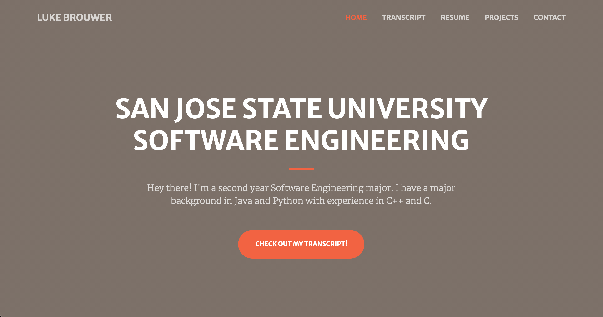

### PORTFOLIO PAGE -- LUKE BROUWER

### Hopefully will be hosted @ lukebrouwer.com

-- 
Website template taken from Bootstrap, repurposed for project. contains three folders:

1)READMEfiles - content for README
  
2)CSS - all CSS files for structuring
  
3)IMG - images stored here
  
4)JS - both javascript files
  
5)MOV - folder for short intro video
  

Should be accessible for all browsers and many fonts. 

[//]: # "Pictures for github"

### LANDING

### CONTACT

